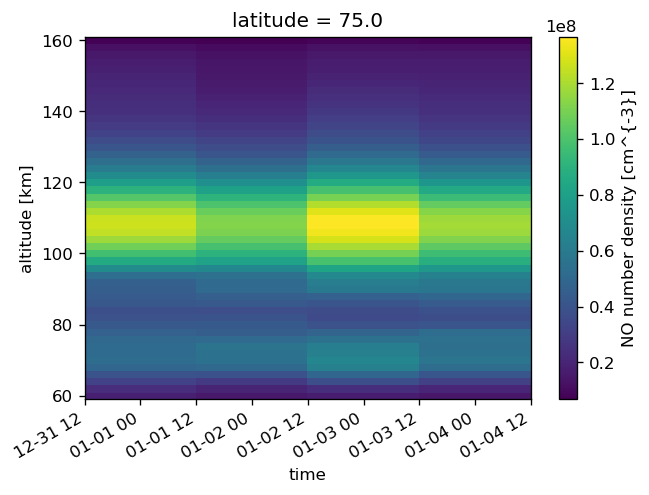
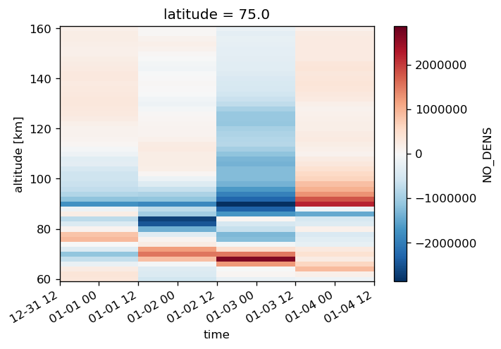
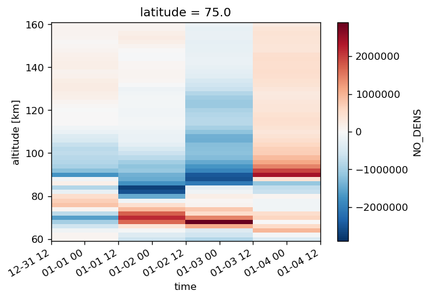
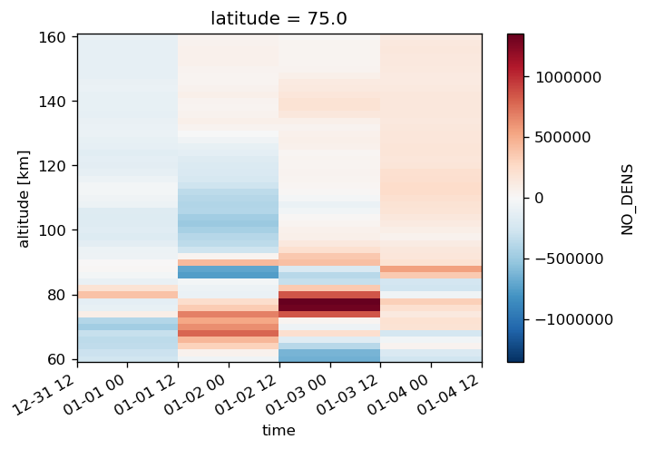
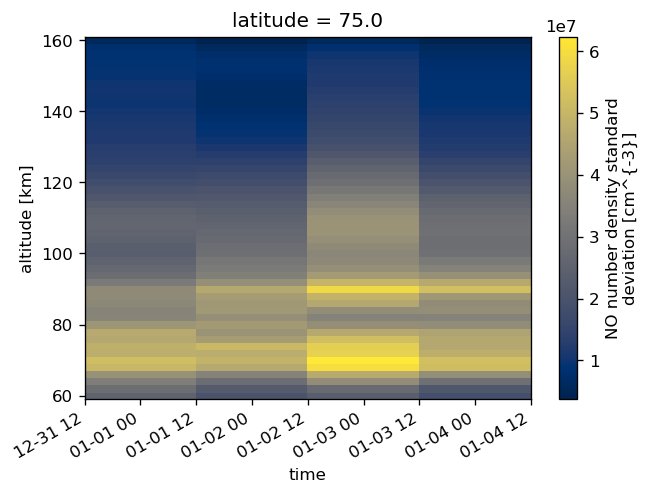
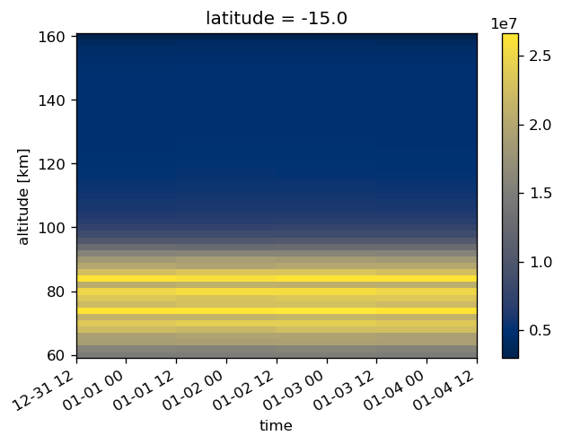
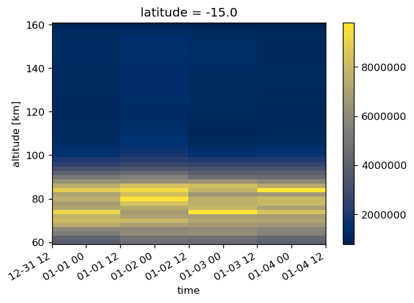
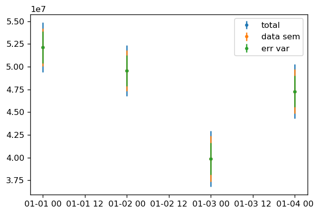

.. module:: sciapy

.. note:: This tutorial was generated from an IPython notebook that can be
          downloaded `here <../_static/notebooks/level2_binning.ipynb>`_.
          Try a live version: |binderbadge|. |nbviewer|__.

.. |binderbadge| image:: https://mybinder.org/badge_logo.svg
    :target: https://mybinder.org/v2/gh/st-bender/sciapy/master?filepath=docs/_static/notebooks/level2_binning.ipynb

.. |nbviewer| replace:: View in *nbviewer*
__ https://nbviewer.jupyter.org/github/st-bender/sciapy/tree/master/docs/_static/notebooks/level2_binning.ipynb

.. _level2_binning:

Level 2 Binning
===============

Standard imports
----------------

First, setup some standard modules and matplotlib.

.. code:: ipython3

    %matplotlib inline
    %config InlineBackend.figure_format = 'png'
    
    import numpy as np
    import xarray as xr
    
    import matplotlib.pyplot as plt

Load the main ``sciapy`` module.

.. code:: ipython3

    import sciapy
    from sciapy.level2.binning import bin_lat_timeavg

.. code:: ipython3

    # Increase figure sizes and fix mathtext
    plt.rcParams["figure.dpi"] = 120
    plt.rcParams["mathtext.default"] = "regular"

.. code:: ipython3

    # Reduce chattiness of our code
    from logging import getLogger
    getLogger().setLevel("WARN")

Raw data
--------

We define helper functions to simplify accessing local or remote data.

.. code:: ipython3

    import requests
    import netCDF4
    
    def load_data_store(store, variables=None, **kwargs):
        with xr.open_dataset(store, **kwargs) as data_ds:
            if variables is not None:
                data_ds = data_ds[variables]
            data_ds.load()
            return data_ds
    
    def load_data_url(url, variables=None, **kwargs):
        with requests.get(url, stream=True) as response:
            nc4_ds = netCDF4.Dataset("data", memory=response.content)
            store = xr.backends.NetCDF4DataStore(nc4_ds)
            return load_data_store(store, variables, **kwargs)

.. code:: ipython3

    data_ds = load_data_store(
        "SCIAMACHY_NO_NOM_orbits_20120101-20120104_v6.2.1.nc",
        decode_times=False,
        chunks={"latitude": 24, "altitude": 26},
    )

We load some data, saved on google drive. Those are small versions of
the full `SCIAMACHY NO data set <https://zenodo.org/record/804371>`__.

.. code:: ipython3

    #url = "https://drive.google.com/uc?id=1oVs1Ue8OVZpwSFFYFy5JBI3PR5E6dONI"  # 2012-01-01 - 2012-01-03
    url = "https://drive.google.com/uc?id=1GZM-4orzEXnRlGMA-n9wo-o5Zv56VB49"  # 2012-01-01 - 2012-01-04
    
    data_ds = load_data_url(
        url,
        decode_times=False,
        chunks={"latitude": 24, "altitude": 26},
    )

Binning and averaging is easier on the raw (float) values. In the case
that the data set contains other time variables except a ``time``
dimension and coordinate, you can skip the conversion of time variables
using ``decode_times=False``.

But then, you have to fix the time coordinate manually:

.. code:: ipython3

    data_ds["time"] = xr.conventions.decode_cf_variable("time", data_ds.time)

The data set contains the post-processed NO data. Bascially any data
will do as long as it has ``time``, ``latitude``, and ``longitude``
dimensions. You can use a third variable to bin the data on, in this
example, we will use geomagnetic latitudes. Let’s have a look at the
content:

.. code:: ipython3

    data_ds

.. parsed-literal::

    <xarray.Dataset>
    Dimensions:        (altitude: 51, latitude: 72, time: 57)
    Coordinates:
      * time           (time) datetime64[ns] 2012-01-01T01:00:34.732819392 ... 2012-01-04T22:33:35.837857984
      * altitude       (altitude) float32 60.0 62.0 64.0 66.0 ... 156.0 158.0 160.0
      * latitude       (latitude) float32 88.75 86.25 83.75 ... -83.75 -86.25 -88.75
    Data variables:
        orbit          (time) int32 51453 51454 51455 51456 ... 51507 51508 51509
        longitude      (time, latitude) float32 680.671 316.555 ... -10.1435 -374.26
        NO_DENS        (time, latitude, altitude) float64 9.377e+06 ... 3.359e+06
        NO_ERR         (time, latitude, altitude) float64 1.723e+06 ... 2.664e+05
        NO_ETOT        (time, latitude, altitude) float64 1.236e+08 ... 6.79e+07
        NO_RSTD        (time, latitude, altitude) float64 18.38 16.42 ... 7.931
        NO_AKDIAG      (time, latitude, altitude) float64 0.0 0.0 0.0 ... 0.0 0.0
        NO_APRIORI     (time, latitude, altitude) float64 0.0 0.0 ... 2.209e+07
        NO_NOEM        (time, latitude, altitude) float64 9.368e+07 ... 2.667e+07
        NO_VMR         (time, latitude, altitude) float64 2.727 3.865 ... 1.202e+05
        app_LST        (time, latitude) float32 21.883951 21.626432 ... 21.977247
        mean_LST       (time, latitude) float32 21.936981 21.67946 ... 22.05358
        mean_SZA       (time, latitude) float32 114.12422 116.093376 ... 68.33748
        UTC            (time, latitude) float64 0.5589 0.5758 0.5927 ... 22.99 23.0
        utc_days       (time, latitude) float64 4.383e+03 4.383e+03 ... 4.387e+03
        gm_lats        (time, latitude) float32 84.331696 85.02615 ... -75.37667
        gm_lons        (time, latitude) float32 145.26302 118.34928 ... 13.52788
        aacgm_gm_lats  (time, latitude) float32 83.91623 85.11143 ... -73.33597
        aacgm_gm_lons  (time, latitude) float32 162.09071 139.56108 ... 21.179602
        MSIS_Temp      (time, latitude, altitude) float64 252.7 246.0 ... 818.3
        MSIS_Dens      (time, latitude, altitude) float64 3.439e+15 ... 2.795e+10
    Attributes:
        version:          2.2
        L2_data_version:  v6.2_fit_noem_apriori
        creation_time:    Mon Oct 09 2017 11:43:37 +00:00 (UTC)
        author:           Stefan Bender

The easiest way to bin the data into geomagnetic locations is to use the
provided pre-calculated geomagnetic latitudes. Those variables are
derived from the latitude/longitude combinations, so they have the same
dimension as ``longitude``:

.. code:: ipython3

    data_ds.gm_lats

.. parsed-literal::

    <xarray.DataArray 'gm_lats' (time: 57, latitude: 72)>
    array([[ 84.331696,  85.02615 ,  87.76751 , ..., -74.830956, -72.70978 ,
            -75.02266 ],
           [ 84.78126 ,  86.64528 ,  85.1038  , ..., -72.68119 , -72.63666 ,
            -75.029884],
           [ 85.00402 ,  87.574165,  82.686935, ..., -71.149734, -73.09879 ,
            -75.2403  ],
           ...,
           [ 82.65202 ,  80.4589  ,  83.06682 , ..., -82.20558 , -76.527885,
            -76.3305  ],
           [ 83.02436 ,  81.3985  ,  85.5422  , ..., -80.9352  , -75.00373 ,
            -75.81156 ],
           [ 83.523766,  82.68859 ,  88.19489 , ..., -78.5798  , -73.75882 ,
            -75.37667 ]], dtype=float32)
    Coordinates:
      * time      (time) datetime64[ns] 2012-01-01T01:00:34.732819392 ... 2012-01-04T22:33:35.837857984
      * latitude  (latitude) float32 88.75 86.25 83.75 ... -83.75 -86.25 -88.75
    Attributes:
        long_name:  geomagnetic_latitude
        model:      IGRF
        units:      degrees_north

To calculate daily means, we use ``xarray``\ ’s ``resample`` interface
and apply the binning function via ``.apply()``:

.. code:: ipython3

    data_binned = data_ds.resample(time="1d").apply(
        bin_lat_timeavg,
        binvar="gm_lats",
        bins=np.r_[-90:91:30],
        area_weighted=False,
    )

.. parsed-literal::

    /home/ben/Work/miniconda3/envs/stats/lib/python3.6/site-packages/xarray/core/nanops.py:162: RuntimeWarning: Mean of empty slice
      return np.nanmean(a, axis=axis, dtype=dtype)

This run produces a data set resampled to daily values and 30°
geomagnetic latitude bins. In addition to the mean values,
``bin_lat_timeavg`` calculates the standard deviation and number of
averaged data points. Both values are supplied as ``<var>_std`` and
``<var>_cnt``, where ``<var>`` stands for the data variable in question.

.. code:: ipython3

    data_binned

.. parsed-literal::

    <xarray.Dataset>
    Dimensions:            (altitude: 51, gm_lats_bins: 6, time: 4)
    Coordinates:
      * time               (time) datetime64[ns] 2012-01-01 ... 2012-01-04
      * gm_lats_bins       (gm_lats_bins) float64 -75.0 -45.0 -15.0 15.0 45.0 75.0
      * altitude           (altitude) float32 60.0 62.0 64.0 ... 156.0 158.0 160.0
    Data variables:
        orbit              (time, gm_lats_bins) float64 5.146e+04 ... 5.15e+04
        longitude          (time, gm_lats_bins) float32 60.51928 ... 295.44537
        NO_DENS            (time, gm_lats_bins, altitude) float64 -2.082e+07 ... 7.386e+06
        NO_ERR             (time, gm_lats_bins, altitude) float64 1.334e+07 ... 1.509e+06
        NO_ETOT            (time, gm_lats_bins, altitude) float64 9.214e+07 ... 8.038e+07
        NO_RSTD            (time, gm_lats_bins, altitude) float64 163.0 ... 32.98
        NO_AKDIAG          (time, gm_lats_bins, altitude) float64 0.006177 ... 0.0007348
        NO_APRIORI         (time, gm_lats_bins, altitude) float64 0.0 ... 1.424e+07
        NO_NOEM            (time, gm_lats_bins, altitude) float64 6.843e+07 ... 2.062e+07
        NO_VMR             (time, gm_lats_bins, altitude) float64 -2.243 ... 2.751e+05
        app_LST            (time, gm_lats_bins) float32 9.768799 ... 14.348375
        mean_LST           (time, gm_lats_bins) float32 9.821828 ... 14.424706
        mean_SZA           (time, gm_lats_bins) float32 61.30505 ... 99.51569
        UTC                (time, gm_lats_bins) float64 11.67 11.72 ... 11.55 12.17
        utc_days           (time, gm_lats_bins) float64 4.383e+03 ... 4.387e+03
        gm_lats            (time, gm_lats_bins) float32 -72.28236 ... 74.27136
        gm_lons            (time, gm_lats_bins) float32 4.6845183 ... 22.456472
        aacgm_gm_lats      (time, gm_lats_bins) float32 -63.07603 ... 77.34904
        aacgm_gm_lons      (time, gm_lats_bins) float32 2.5101104 ... -1.7533023
        MSIS_Temp          (time, gm_lats_bins, altitude) float64 265.4 ... 714.1
        MSIS_Dens          (time, gm_lats_bins, altitude) float64 9.252e+15 ... 2.688e+10
        wsqsum             (time, gm_lats_bins) float32 0.0062893075 ... 0.0062111802
        orbit_std          (time, gm_lats_bins) float64 4.58 3.879 ... 3.884 4.012
        longitude_std      (time, gm_lats_bins) float64 165.2 107.9 ... 106.8 170.6
        NO_DENS_std        (time, gm_lats_bins, altitude) float64 2.116e+07 ... 3.359e+06
        NO_ERR_std         (time, gm_lats_bins, altitude) float64 4.678e+06 ... 1.509e+06
        NO_ETOT_std        (time, gm_lats_bins, altitude) float64 5.485e+06 ... 4.914e+06
        NO_RSTD_std        (time, gm_lats_bins, altitude) float64 548.9 ... 116.6
        NO_AKDIAG_std      (time, gm_lats_bins, altitude) float64 0.006565 ... 0.001811
        NO_APRIORI_std     (time, gm_lats_bins, altitude) float64 0.0 ... 1.96e+06
        NO_NOEM_std        (time, gm_lats_bins, altitude) float64 4.991e+06 ... 8.959e+05
        NO_VMR_std         (time, gm_lats_bins, altitude) float64 2.312 ... 1.25e+05
        app_LST_std        (time, gm_lats_bins) float64 5.965 0.4112 ... 3.748
        mean_LST_std       (time, gm_lats_bins) float64 5.965 0.4112 ... 3.748
        mean_SZA_std       (time, gm_lats_bins) float64 8.639 7.489 ... 8.383 10.39
        UTC_std            (time, gm_lats_bins) float64 7.659 6.496 ... 6.507 6.713
        utc_days_std       (time, gm_lats_bins) float64 0.3191 0.2706 ... 0.2797
        gm_lats_std        (time, gm_lats_bins) float64 6.725 8.79 ... 8.746 7.847
        gm_lons_std        (time, gm_lats_bins) float64 76.51 90.55 ... 103.7 116.3
        aacgm_gm_lats_std  (time, gm_lats_bins) float64 10.08 12.31 ... 11.75 7.525
        aacgm_gm_lons_std  (time, gm_lats_bins) float64 25.09 42.02 ... 59.91 97.16
        MSIS_Temp_std      (time, gm_lats_bins, altitude) float64 3.77 ... 13.79
        MSIS_Dens_std      (time, gm_lats_bins, altitude) float64 4.178e+14 ... 7.472e+08
        orbit_cnt          (time, gm_lats_bins) int64 159 179 172 ... 169 168 161
        longitude_cnt      (time, gm_lats_bins) int64 159 179 172 ... 169 168 161
        NO_DENS_cnt        (time, gm_lats_bins, altitude) int64 159 159 ... 161 161
        NO_ERR_cnt         (time, gm_lats_bins, altitude) int64 159 159 ... 161 161
        NO_ETOT_cnt        (time, gm_lats_bins, altitude) int64 159 159 ... 161 161
        NO_RSTD_cnt        (time, gm_lats_bins, altitude) int64 159 159 ... 161 161
        NO_AKDIAG_cnt      (time, gm_lats_bins, altitude) int64 159 159 ... 161 161
        NO_APRIORI_cnt     (time, gm_lats_bins, altitude) int64 159 159 ... 161 161
        NO_NOEM_cnt        (time, gm_lats_bins, altitude) int64 159 159 ... 161 161
        NO_VMR_cnt         (time, gm_lats_bins, altitude) int64 159 159 ... 161 161
        app_LST_cnt        (time, gm_lats_bins) int64 159 179 172 ... 169 168 161
        mean_LST_cnt       (time, gm_lats_bins) int64 159 179 172 ... 169 168 161
        mean_SZA_cnt       (time, gm_lats_bins) int64 159 179 172 ... 169 168 161
        UTC_cnt            (time, gm_lats_bins) int64 159 179 172 ... 169 168 161
        utc_days_cnt       (time, gm_lats_bins) int64 159 179 172 ... 169 168 161
        gm_lats_cnt        (time, gm_lats_bins) int64 159 179 172 ... 169 168 161
        gm_lons_cnt        (time, gm_lats_bins) int64 159 179 172 ... 169 168 161
        aacgm_gm_lats_cnt  (time, gm_lats_bins) int64 159 179 172 ... 169 168 161
        aacgm_gm_lons_cnt  (time, gm_lats_bins) int64 159 179 172 ... 169 168 161
        MSIS_Temp_cnt      (time, gm_lats_bins, altitude) int64 159 159 ... 161 161
        MSIS_Dens_cnt      (time, gm_lats_bins, altitude) int64 159 159 ... 161 161
    Attributes:
        version:          2.2
        L2_data_version:  v6.2_fit_noem_apriori
        creation_time:    Mon Oct 09 2017 11:43:37 +00:00 (UTC)
        author:           Stefan Bender

The data are now binned into daily 30° latitude bins, but we probably
want the latitudes still be named “latitude”.

.. code:: ipython3

    data_binned = data_binned.rename({"gm_lats_bins": "latitude"})

External binning
----------------

There are various packages around for converting geographic locations to
geomagnetic locations (or whatever geo-coordinate system you like).

Two of the main packages usually used are
`aacgmv2 <https://aacgmv2.readthedocs.io>`__ and
`apexpy <https://apexpy.readthedocs.io>`__

aacgmv2
~~~~~~~

.. code:: ipython3

    import aacgmv2

For using the ``sciapy.level2.binning`` method, you need to put the
coordinates you want to bin tghe data on into data variables first. You
can set this variable for example by defining helper function like this
(the ``idx`` parameter can be used for switching to longitudes by
setting it to ``1``):

.. code:: ipython3

    def conv_gm_lat(da, idx=0, alt=110.):
        return [aacgmv2.convert(
                    da.latitude.data,
                    d,
                    alt,
                    date=d.time.data.astype("M8[s]").astype("O"),
                )[idx]
                for d in da
               ]

Then apply the helper function to the longitudes through via
``.pipe()``. If you supply a new data variable directly as a tuple has
the advantage that ``xarray`` can work its magic and assigns the
dimensions and coordinates automatically:

.. code:: ipython3

    data_ds["AACGMv2_lats"] = (
        ["time", "latitude"],
        data_ds.longitude.pipe(conv_gm_lat, idx=0, alt=data_ds.altitude.mean()))

.. parsed-literal::

    /home/ben/Work/miniconda3/envs/stats/lib/python3.6/site-packages/numpy/lib/function_base.py:2048: RuntimeWarning: AACGM_v2_Convert returned error code -1
      outputs = ufunc(*inputs)

Alternatively, you can supply the latitude list directly via an
appropriate list comprehension:

.. code:: ipython3

    data_ds["AACGMv2_lats2"] = (
        ["time", "latitude"],
        [aacgmv2.convert(
             data_ds.latitude.data,
             long.data,
             data_ds.altitude.mean().data,
             date=date.data.astype("M8[s]").astype("O"),
         )[0]
         for date, long in zip(data_ds.time, data_ds.longitude)])

Whatever way you chose to prepare the data variable to bin the data on,
you can now use it in the same way as ``gm_lats`` before:

.. code:: ipython3

    data_binned2 = data_ds.resample(time="1d").apply(
        bin_lat_timeavg,
        binvar="AACGMv2_lats",
        bins=np.r_[-90:91:30],
        area_weighted=False,
    )

.. code:: ipython3

    data_binned2

.. parsed-literal::

    <xarray.Dataset>
    Dimensions:            (AACGMv2_lats_bins: 6, altitude: 51, time: 4)
    Coordinates:
      * time               (time) datetime64[ns] 2012-01-01 ... 2012-01-04
      * AACGMv2_lats_bins  (AACGMv2_lats_bins) float64 -75.0 -45.0 ... 45.0 75.0
      * altitude           (altitude) float32 60.0 62.0 64.0 ... 156.0 158.0 160.0
    Data variables:
        orbit              (time, AACGMv2_lats_bins) float64 5.146e+04 ... 5.15e+04
        longitude          (time, AACGMv2_lats_bins) float32 56.82753 ... 290.32748
        NO_DENS            (time, AACGMv2_lats_bins, altitude) float64 -2.081e+07 ... 7.647e+06
        NO_ERR             (time, AACGMv2_lats_bins, altitude) float64 1.334e+07 ... 1.611e+06
        NO_ETOT            (time, AACGMv2_lats_bins, altitude) float64 9.214e+07 ... 8.028e+07
        NO_RSTD            (time, AACGMv2_lats_bins, altitude) float64 146.0 ... 35.93
        NO_AKDIAG          (time, AACGMv2_lats_bins, altitude) float64 0.006205 ... 0.0009047
        NO_APRIORI         (time, AACGMv2_lats_bins, altitude) float64 0.0 ... 1.412e+07
        NO_NOEM            (time, AACGMv2_lats_bins, altitude) float64 6.839e+07 ... 2.047e+07
        NO_VMR             (time, AACGMv2_lats_bins, altitude) float64 -2.243 ... 2.847e+05
        app_LST            (time, AACGMv2_lats_bins) float32 9.781969 ... 14.2096615
        mean_LST           (time, AACGMv2_lats_bins) float32 9.834998 ... 14.285992
        mean_SZA           (time, AACGMv2_lats_bins) float32 61.200176 ... 98.79113
        UTC                (time, AACGMv2_lats_bins) float64 11.63 11.72 ... 12.07
        utc_days           (time, AACGMv2_lats_bins) float64 4.383e+03 ... 4.387e+03
        gm_lats            (time, AACGMv2_lats_bins) float32 -72.263626 ... 73.571884
        gm_lons            (time, AACGMv2_lats_bins) float32 7.3087535 ... 25.604252
        aacgm_gm_lats      (time, AACGMv2_lats_bins) float32 -63.15835 ... 77.0171
        aacgm_gm_lons      (time, AACGMv2_lats_bins) float32 1.4909898 ... -2.2973938
        MSIS_Temp          (time, AACGMv2_lats_bins, altitude) float64 265.4 ... 714.7
        MSIS_Dens          (time, AACGMv2_lats_bins, altitude) float64 9.246e+15 ... 2.69e+10
        AACGMv2_lats       (time, AACGMv2_lats_bins) float64 -71.49 -45.57 ... 74.19
        AACGMv2_lats2      (time, AACGMv2_lats_bins) float64 -71.49 -45.57 ... 74.19
        wsqsum             (time, AACGMv2_lats_bins) float64 0.006289 ... 0.005952
        orbit_std          (time, AACGMv2_lats_bins) float64 4.575 3.731 ... 3.912
        longitude_std      (time, AACGMv2_lats_bins) float64 163.1 112.6 ... 170.8
        NO_DENS_std        (time, AACGMv2_lats_bins, altitude) float64 2.115e+07 ... 4.031e+06
        NO_ERR_std         (time, AACGMv2_lats_bins, altitude) float64 4.676e+06 ... 1.562e+06
        NO_ETOT_std        (time, AACGMv2_lats_bins, altitude) float64 5.486e+06 ... 4.833e+06
        NO_RSTD_std        (time, AACGMv2_lats_bins, altitude) float64 488.9 ... 117.8
        NO_AKDIAG_std      (time, AACGMv2_lats_bins, altitude) float64 0.006534 ... 0.001954
        NO_APRIORI_std     (time, AACGMv2_lats_bins, altitude) float64 0.0 ... 2.017e+06
        NO_NOEM_std        (time, AACGMv2_lats_bins, altitude) float64 5.099e+06 ... 1.153e+06
        NO_VMR_std         (time, AACGMv2_lats_bins, altitude) float64 2.311 ... 1.502e+05
        app_LST_std        (time, AACGMv2_lats_bins) float64 5.961 0.4403 ... 3.729
        mean_LST_std       (time, AACGMv2_lats_bins) float64 5.961 0.4403 ... 3.729
        mean_SZA_std       (time, AACGMv2_lats_bins) float64 8.668 7.76 ... 10.82
        UTC_std            (time, AACGMv2_lats_bins) float64 7.651 6.249 ... 6.544
        utc_days_std       (time, AACGMv2_lats_bins) float64 0.3188 ... 0.2727
        gm_lats_std        (time, AACGMv2_lats_bins) float64 6.758 10.19 ... 8.378
        gm_lons_std        (time, AACGMv2_lats_bins) float64 76.25 87.65 ... 115.1
        aacgm_gm_lats_std  (time, AACGMv2_lats_bins) float64 9.982 11.89 ... 7.591
        aacgm_gm_lons_std  (time, AACGMv2_lats_bins) float64 25.95 44.65 ... 94.99
        MSIS_Temp_std      (time, AACGMv2_lats_bins, altitude) float64 3.731 ... 13.92
        MSIS_Dens_std      (time, AACGMv2_lats_bins, altitude) float64 4.162e+14 ... 7.485e+08
        AACGMv2_lats_std   (time, AACGMv2_lats_bins) float64 6.609 8.546 ... 7.944
        AACGMv2_lats2_std  (time, AACGMv2_lats_bins) float64 6.609 8.546 ... 7.944
        orbit_cnt          (time, AACGMv2_lats_bins) int64 159 193 154 ... 160 168
        longitude_cnt      (time, AACGMv2_lats_bins) int64 159 193 154 ... 160 168
        NO_DENS_cnt        (time, AACGMv2_lats_bins, altitude) int64 159 159 ... 168
        NO_ERR_cnt         (time, AACGMv2_lats_bins, altitude) int64 159 159 ... 168
        NO_ETOT_cnt        (time, AACGMv2_lats_bins, altitude) int64 159 159 ... 168
        NO_RSTD_cnt        (time, AACGMv2_lats_bins, altitude) int64 159 159 ... 168
        NO_AKDIAG_cnt      (time, AACGMv2_lats_bins, altitude) int64 159 159 ... 168
        NO_APRIORI_cnt     (time, AACGMv2_lats_bins, altitude) int64 159 159 ... 168
        NO_NOEM_cnt        (time, AACGMv2_lats_bins, altitude) int64 159 159 ... 168
        NO_VMR_cnt         (time, AACGMv2_lats_bins, altitude) int64 159 159 ... 168
        app_LST_cnt        (time, AACGMv2_lats_bins) int64 159 193 154 ... 160 168
        mean_LST_cnt       (time, AACGMv2_lats_bins) int64 159 193 154 ... 160 168
        mean_SZA_cnt       (time, AACGMv2_lats_bins) int64 159 193 154 ... 160 168
        UTC_cnt            (time, AACGMv2_lats_bins) int64 159 193 154 ... 160 168
        utc_days_cnt       (time, AACGMv2_lats_bins) int64 159 193 154 ... 160 168
        gm_lats_cnt        (time, AACGMv2_lats_bins) int64 159 193 154 ... 160 168
        gm_lons_cnt        (time, AACGMv2_lats_bins) int64 159 193 154 ... 160 168
        aacgm_gm_lats_cnt  (time, AACGMv2_lats_bins) int64 159 193 154 ... 160 168
        aacgm_gm_lons_cnt  (time, AACGMv2_lats_bins) int64 159 193 154 ... 160 168
        MSIS_Temp_cnt      (time, AACGMv2_lats_bins, altitude) int64 159 159 ... 168
        MSIS_Dens_cnt      (time, AACGMv2_lats_bins, altitude) int64 159 159 ... 168
        AACGMv2_lats_cnt   (time, AACGMv2_lats_bins) int64 159 193 154 ... 160 168
        AACGMv2_lats2_cnt  (time, AACGMv2_lats_bins) int64 159 193 154 ... 160 168
    Attributes:
        version:          2.2
        L2_data_version:  v6.2_fit_noem_apriori
        creation_time:    Mon Oct 09 2017 11:43:37 +00:00 (UTC)
        author:           Stefan Bender

.. code:: ipython3

    data_binned2 = data_binned2.rename({"AACGMv2_lats_bins": "latitude"})

.. code:: ipython3

    data_binned2.sel(latitude=75).NO_DENS.plot(x="time")

.. parsed-literal::

    <matplotlib.collections.QuadMesh at 0x7fd4754d7e48>

.. code:: ipython3

    (data_binned2.sel(latitude=75).NO_DENS - data_binned.sel(latitude=75).NO_DENS).plot(x="time")

.. parsed-literal::

    <matplotlib.collections.QuadMesh at 0x7fd474e3e208>

.. image:: level2_binning_files/level2_binning_38_1.png

apexpy
~~~~~~

.. code:: ipython3

    import apexpy

For the sake of brewity, we skip the definition of a helper function and
construct the bin variables directly. ``apexpy`` provides two main
variants, “quasi-dipole” and “apex” coordinates, see also [1] and the
other
`references <https://apexpy.readthedocs.io/en/latest/authors.html>`__ on
the `apexpy documentation page <https://apexpy.readthedocs.io>`__

[1] Emmert, J. T., A. D. Richmond, and D. P. Drob (2010), A
computationally compact representation of Magnetic-Apex and Quasi-Dipole
coordinates with smooth base vectors, J. Geophys. Res., 115(A8), A08322,
`doi:10.1029/2010JA015326 <https://doi.org/10.1029/2010JA015326>`__.

.. code:: ipython3

    data_ds["qd_lats"] = (
        ["time", "latitude"],
        [apexpy.Apex(date=date.data.astype("M8[s]").astype("O"))
             .convert(
                 data_ds.latitude.values,
                  long.values,
                  "geo",
                  "qd",
                  height=data_ds.altitude.mean().values,
             )[0]
         for date, long in zip(data_ds.time, data_ds.longitude)])

.. code:: ipython3

    data_ds["apex_lats"] = (
        ["time", "latitude"],
        [apexpy.Apex(date=date.data.astype("M8[s]").astype("O"))
             .convert(
                 data_ds.latitude.values,
                  long.values,
                  "geo",
                  "apex",
                  height=data_ds.altitude.mean().values,
             )[0]
         for date, long in zip(data_ds.time, data_ds.longitude)])

.. code:: ipython3

    data_binnedqd = data_ds.resample(time="1d").apply(
        bin_lat_timeavg,
        binvar="qd_lats",
        bins=np.r_[-90:91:30],
        area_weighted=False,
    )

.. parsed-literal::

    /home/ben/Work/miniconda3/envs/stats/lib/python3.6/site-packages/xarray/core/nanops.py:162: RuntimeWarning: Mean of empty slice
      return np.nanmean(a, axis=axis, dtype=dtype)

.. code:: ipython3

    data_binnedqd = data_binnedqd.rename({"qd_lats_bins": "latitude"})

.. code:: ipython3

    data_binnedapex = data_ds.resample(time="1d").apply(
        bin_lat_timeavg,
        binvar="apex_lats",
        bins=np.r_[-90:91:30],
        area_weighted=False,
    )

.. code:: ipython3

    data_binnedapex = data_binnedapex.rename({"apex_lats_bins": "latitude"})

.. code:: ipython3

    (data_binnedqd.sel(latitude=75).NO_DENS - data_binned.sel(latitude=75).NO_DENS).plot(x="time")

.. parsed-literal::

    <matplotlib.collections.QuadMesh at 0x7fd47555ed68>

.. code:: ipython3

    (data_binnedapex.sel(latitude=75).NO_DENS - data_binned.sel(latitude=75).NO_DENS).plot(x="time")

.. parsed-literal::

    <matplotlib.collections.QuadMesh at 0x7fd474c736a0>

.. code:: ipython3

    (data_binnedapex.sel(latitude=75) - data_binnedqd.sel(latitude=75)).NO_DENS.plot(x="time")

.. parsed-literal::

    <matplotlib.collections.QuadMesh at 0x7fd474be1b00>

.. code:: ipython3

    data_binned2.sel(latitude=75).NO_DENS_std.plot(x="time", cmap="cividis")

.. parsed-literal::

    <matplotlib.collections.QuadMesh at 0x7fd474b823c8>

.. code:: ipython3

    mean_N = data_binned2.NO_ERR_cnt
    mean_var = (mean_N - 1) / mean_N * data_binned2.NO_ERR_std**2 + data_binned2.NO_ERR**2
    mean_err = np.sqrt(mean_var)

.. code:: ipython3

    mean_err.sel(latitude=-15).plot(x="time", cmap="cividis")

.. parsed-literal::

    <matplotlib.collections.QuadMesh at 0x7fd474a9e630>

.. code:: ipython3

    full_var = data_binned2.NO_DENS_std**2 + mean_var
    full_err = np.sqrt(full_var)

.. code:: ipython3

    (full_err - data_binned2.NO_DENS_std).sel(latitude=-15).plot(x="time", cmap="cividis")

.. parsed-literal::

    <matplotlib.collections.QuadMesh at 0x7fd474a3c5f8>

.. code:: ipython3

    lat, alt = -15, 72
    data_bin = data_binned2.sel(latitude=lat, altitude=alt)
    plt.errorbar(data_bin.time.data,
                 data_bin.NO_DENS.data,
                 yerr=full_err.sel(latitude=lat, altitude=alt) / np.sqrt(mean_N.sel(latitude=lat, altitude=alt)),
                 fmt='.',
                 label="total",
                )
    plt.errorbar(data_bin.time.data,
                 data_bin.NO_DENS.data,
                 yerr=data_bin.NO_DENS_std.data / np.sqrt(mean_N.sel(latitude=lat, altitude=alt)),
                 fmt='.',
                 label="data sem",
                )
    plt.errorbar(data_bin.time.data,
                 data_bin.NO_DENS.data,
                 yerr=mean_err.sel(latitude=lat, altitude=alt) / np.sqrt(mean_N.sel(latitude=lat, altitude=alt)),
                 fmt='.',
                 label="err var",
                )
    plt.legend();

