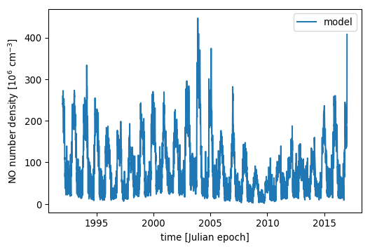
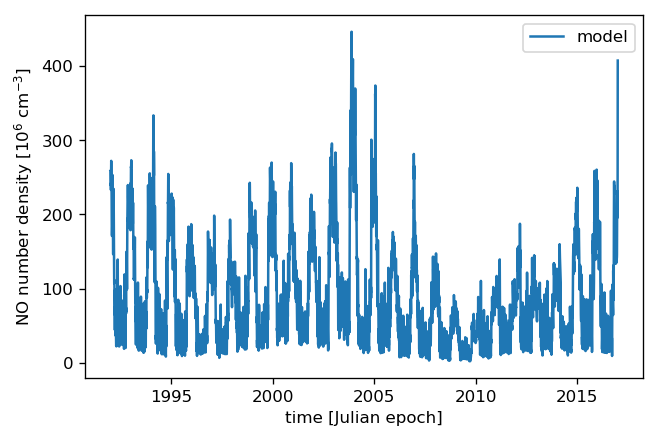

.. module:: sciapy

.. note:: This tutorial was generated from an IPython notebook that can be
          downloaded `here <../_static/notebooks/regress_intro.ipynb>`_.
          Try a live version: |binderbadge|.

.. |binderbadge| image:: https://mybinder.org/badge.svg
    :target: https://mybinder.org/v2/gh/st-bender/sciapy/master?filepath=docs/_static/notebooks/regress_intro.ipynb

.. _regress_intro:

Regression model intro
======================

Standard imports
----------------

First, setup some standard modules and matplotlib.

.. code:: ipython3

    %matplotlib inline
    %config InlineBackend.figure_format = 'png'
    
    import numpy as np
    import xarray as xr
    
    import matplotlib.pyplot as plt

Load the main ``sciapy`` module and its wrappers for easy access to the
used proxy timeseries.

.. code:: ipython3

    import sciapy
    from sciapy.regress.load_data import load_dailymeanAE, load_dailymeanLya

.. code:: ipython3

    plt.rcParams["figure.dpi"] = 96

Model interface
---------------

The model is set up part by part, beginning with the more involved proxy
models.

Lyman-\ :math:`\alpha` proxy
~~~~~~~~~~~~~~~~~~~~~~~~~~~~

We start with the Lyman-\ :math:`\alpha` proxy, it is not centered
(mean-subtracted) and we set the rest of the parameters except
``ltscan`` to zero.

.. code:: ipython3

    # load proxy data
    plat, plap = load_dailymeanLya()
    # setup the model
    lya_mod = sciapy.regress.ProxyModel(plat,
                                        plap["Lya"],
                                        center=False,
                                        amp=0,
                                        lag=0,
                                        tau0=0,
                                        taucos1=0, tausin1=0,
                                        taucos2=0, tausin2=0,
                                        ltscan=60)

AE proxy with lifetime
~~~~~~~~~~~~~~~~~~~~~~

The AE proxy is also not centered and we start with the same parameters
as above.

.. code:: ipython3

    # load proxy data
    paet, paep = load_dailymeanAE()
    # setup the model
    ae_mod = sciapy.regress.ProxyModel(paet,
                                       paep["AE"],
                                       center=False,
                                       amp=0,
                                       lag=0,
                                       tau0=0,
                                       taucos1=0, tausin1=0,
                                       taucos2=0, tausin2=0,
                                       ltscan=60)

Offset
~~~~~~

We use the ``ConstantModel`` (inherited from ``celerite``) for the
constant offset.

.. code:: ipython3

    offset_model = sciapy.regress.ConstantModel(value=0.)

Optional harmonic terms
~~~~~~~~~~~~~~~~~~~~~~~

The harmonic terms are not used here but we include them to show how to
set them up.

.. code:: ipython3

    harm1 = sciapy.regress.HarmonicModelCosineSine(freq=1, cos=0, sin=0)
    harm2 = sciapy.regress.HarmonicModelCosineSine(freq=2, cos=0, sin=0)
    
    # frequencies should not be fitted
    harm1.freeze_parameter("freq")
    harm2.freeze_parameter("freq")

Combined model
--------------

.. code:: ipython3

    no_mod = sciapy.regress.CeleriteModelSet([("offset", offset_model),
                                              ("Lya", lya_mod), ("GM", ae_mod),
                                              ("f1", harm1), ("f2", harm2)])

The full model has the following parameters:

.. code:: ipython3

    no_mod.get_parameter_dict()

.. parsed-literal::

    OrderedDict([('offset:value', 0.0),
                 ('Lya:amp', 0.0),
                 ('Lya:lag', 0.0),
                 ('Lya:tau0', 0.0),
                 ('Lya:taucos1', 0.0),
                 ('Lya:tausin1', 0.0),
                 ('Lya:taucos2', 0.0),
                 ('Lya:tausin2', 0.0),
                 ('Lya:ltscan', 60.0),
                 ('GM:amp', 0.0),
                 ('GM:lag', 0.0),
                 ('GM:tau0', 0.0),
                 ('GM:taucos1', 0.0),
                 ('GM:tausin1', 0.0),
                 ('GM:taucos2', 0.0),
                 ('GM:tausin2', 0.0),
                 ('GM:ltscan', 60.0),
                 ('f1:cos', 0.0),
                 ('f1:sin', 0.0),
                 ('f2:cos', 0.0),
                 ('f2:sin', 0.0)])

But we don’t need all of them, so we freeze all parameters and thaw the
ones we need. This is easier than the other way around (freezing all
unused parameters).

.. code:: ipython3

    no_mod.freeze_all_parameters()
    no_mod.thaw_parameter("offset:value")
    no_mod.thaw_parameter("Lya:amp")
    no_mod.thaw_parameter("GM:amp")
    no_mod.thaw_parameter("GM:tau0")
    no_mod.thaw_parameter("GM:taucos1")
    no_mod.thaw_parameter("GM:tausin1")

Cross check that only the used parameters are really active:

.. code:: ipython3

    no_mod.get_parameter_dict()

.. parsed-literal::

    OrderedDict([('offset:value', 0.0),
                 ('Lya:amp', 0.0),
                 ('GM:amp', 0.0),
                 ('GM:tau0', 0.0),
                 ('GM:taucos1', 0.0),
                 ('GM:tausin1', 0.0)])

Model parameters
----------------

Manually setting the parameters
~~~~~~~~~~~~~~~~~~~~~~~~~~~~~~~

Now we set the model parameters to something non-trivial, with the same
order as listed above:

.. code:: ipython3

    no_mod.set_parameter_vector([-25.6, 6.26, 0.0874, 1.54, 10.52, -0.714])

.. code:: ipython3

    no_mod.get_parameter_dict()

.. parsed-literal::

    OrderedDict([('offset:value', -25.6),
                 ('Lya:amp', 6.26),
                 ('GM:amp', 0.0874),
                 ('GM:tau0', 1.54),
                 ('GM:taucos1', 10.52),
                 ('GM:tausin1', -0.714)])

With the parameters properly set, we can now “predict” the density for
any time we wish. Here we take 15 years daily:

.. code:: ipython3

    times = np.arange(1992, 2017.01, 0.5 / 365.25)
    pred_no = no_mod.get_value(times)

and then plot the result:

.. code:: ipython3

    plt.plot(times, pred_no, label="model")
    plt.xlabel("time [Julian epoch]")
    # The data were scaled by 10^-6 before fitting
    plt.ylabel("NO number density [10$^6$ cm$^{{-3}}$]")
    plt.legend();

Setting the parameters from file
~~~~~~~~~~~~~~~~~~~~~~~~~~~~~~~~

Instead of making up some numbers for the parameters, we can take “real”
ones. We use the ones determined by fitting the model to actual data, in
this case SCIAMACHY nitric oxide daily zonal mean data.

The daily zonal mean data and the quantiles of the sampled parameters are available at
https://zenodo.org/record/1342701 |DOI|

.. |DOI| image:: https://zenodo.org/badge/DOI/10.5281/zenodo.1342701.svg
    :target: https://doi.org/10.5281/zenodo.1342701

We connect to zenodo and load the contents into memory. It’s a rather
small file so that should be no problem, but we need the requests and
netCDF4 modules for that. The alternative would be to download a copy
into the same folder as this notebook.

.. code:: ipython3

    import requests
    import netCDF4

.. code:: ipython3

    zenodo_url = "https://zenodo.org/record/1342701/files/NO_regress_quantiles_pGM_Lya_ltcs_exp1dscan60d_km32.nc"
    
    response = requests.get(zenodo_url)
    nc4_ds = netCDF4.Dataset("quantiles", memory=response.content)
    store = xr.backends.NetCDF4DataStore(nc4_ds)
    
    # If you downloaded a copy, replace `store` by "/path/to/<filename.nc>"
    quants = xr.open_dataset(store, decode_cf=False)

The data file contains the median together with the (0.16, 0.84),
(0.025, 0.975), and (0.001, 0.999) quantiles corresponding to the
1\ :math:`\sigma`, 2\ :math:`\sigma`, and 3\ :math:`\sigma` confidence
regions. In particular, the contents of the quantiles dataset are:

.. code:: ipython3

    quants

.. parsed-literal::

    <xarray.Dataset>
    Dimensions:            (alt: 16, lat: 18, quantile: 7)
    Coordinates:
      * alt                (alt) float64 60.0 62.0 64.0 66.0 ... 84.0 86.0 88.0 90.0
      * lat                (lat) float64 -85.0 -75.0 -65.0 -55.0 ... 65.0 75.0 85.0
      * quantile           (quantile) float64 0.001 0.025 0.16 0.5 0.84 0.975 0.999
    Data variables:
        kernel:log_rho     (lat, alt, quantile) float64 ...
        kernel:log_sigma   (lat, alt, quantile) float64 ...
        mean:GM:amp        (lat, alt, quantile) float64 ...
        mean:GM:tau0       (lat, alt, quantile) float64 ...
        mean:GM:taucos1    (lat, alt, quantile) float64 ...
        mean:GM:tausin1    (lat, alt, quantile) float64 ...
        mean:Lya:amp       (lat, alt, quantile) float64 ...
        mean:offset:value  (lat, alt, quantile) float64 ...

The dimensions of the available parameters are:

.. code:: ipython3

    quants.lat, quants.alt

.. parsed-literal::

    (<xarray.DataArray 'lat' (lat: 18)>
     array([-85., -75., -65., -55., -45., -35., -25., -15.,  -5.,   5.,  15.,  25.,
             35.,  45.,  55.,  65.,  75.,  85.])
     Coordinates:
       * lat      (lat) float64 -85.0 -75.0 -65.0 -55.0 -45.0 ... 55.0 65.0 75.0 85.0
     Attributes:
         _FillValue:  nan
         long_name:   latitude
         units:       degrees_north, <xarray.DataArray 'alt' (alt: 16)>
     array([60., 62., 64., 66., 68., 70., 72., 74., 76., 78., 80., 82., 84., 86.,
            88., 90.])
     Coordinates:
       * alt      (alt) float64 60.0 62.0 64.0 66.0 68.0 ... 82.0 84.0 86.0 88.0 90.0
     Attributes:
         _FillValue:  nan
         long_name:   altitude
         units:       km)

We loop over the parameter names and set the parameters to the median
values (``quantile=0.5``) for the selected altitude and latitude bin.
The variables in the quantiles file were created using
`celerite <https://github.com/dfm/celerite>`__ which prepends “mean:” to
the variables from the mean model.

.. code:: ipython3

    # select latitude and altitude first
    latitude = 65
    altitude = 70
    
    for v in no_mod.get_parameter_names():
        no_mod.set_parameter(v, quants["mean:{0}".format(v)].sel(alt=altitude, lat=latitude, quantile=0.5))

The parameters from the file are (actually pretty close to the ones
above):

.. code:: ipython3

    no_mod.get_parameter_dict()

.. parsed-literal::

    OrderedDict([('offset:value', -25.577781189820513),
                 ('Lya:amp', 6.259250259251973),
                 ('GM:amp', 0.08741185118056463),
                 ('GM:tau0', 1.5387433096984084),
                 ('GM:taucos1', 10.520064600296648),
                 ('GM:tausin1', -0.7141699243523804)])

We take the same times as above (15 years daily) to predict the model
values:

.. code:: ipython3

    pred_no = no_mod.get_value(times)

and then plot the result again:

.. code:: ipython3

    plt.plot(times, pred_no, label="model")
    plt.xlabel("time [Julian epoch]")
    # Again, the data were scaled by 10^-6 before fitting, so adjust the X-Axis label
    plt.ylabel("NO number density [10$^6$ cm$^{{-3}}$]")
    plt.legend();

