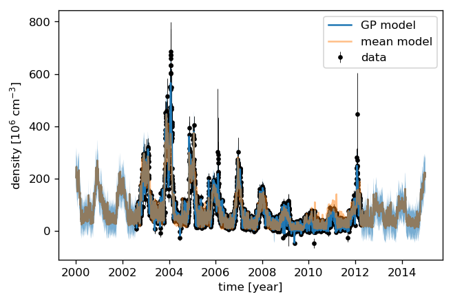
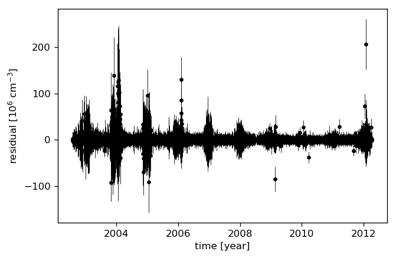
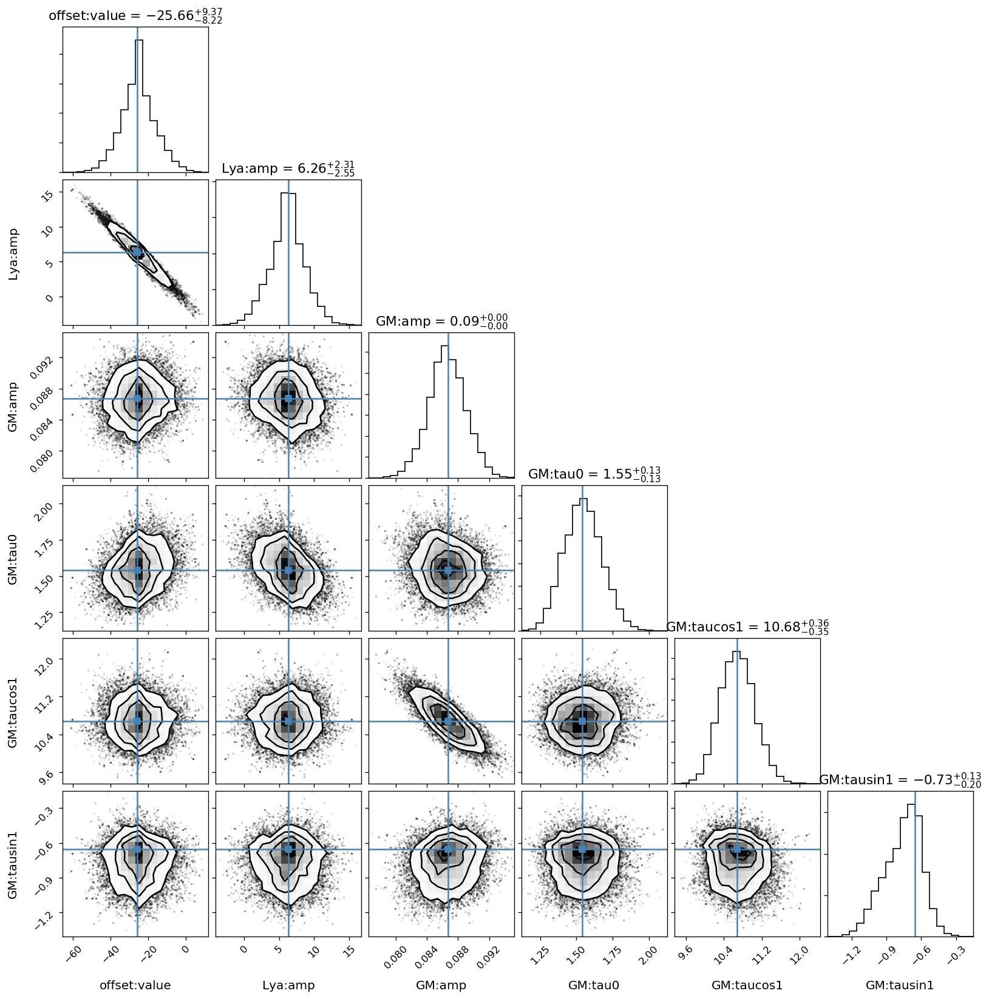
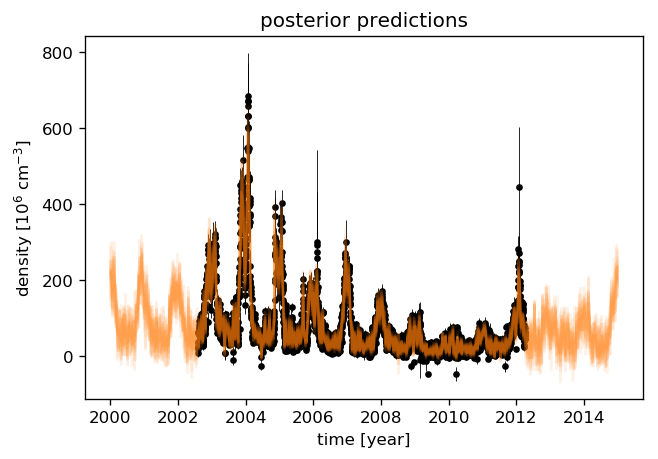

.. module:: sciapy

.. note:: This tutorial was generated from an IPython notebook that can be
          downloaded `here <../_static/notebooks/regress_model_fit.ipynb>`_.
          Try a live version: |binderbadge|. |nbviewer|__.

.. |binderbadge| image:: https://mybinder.org/badge_logo.svg
    :target: https://mybinder.org/v2/gh/st-bender/sciapy/master?filepath=docs/_static/notebooks/regress_model_fit.ipynb

.. |nbviewer| replace:: View in *nbviewer*
__ https://nbviewer.jupyter.org/github/st-bender/sciapy/tree/master/docs/_static/notebooks/regress_model_fit.ipynb

.. _regress_model_fit:

Regression model fitting
========================

Standard imports
----------------

First, setup some standard modules and matplotlib.

.. code:: ipython3

    %matplotlib inline
    %config InlineBackend.figure_format = 'png'
    
    import numpy as np
    import xarray as xr
    
    import matplotlib.pyplot as plt

Load the main ``sciapy`` module and its wrappers for easy access to the
used proxy timeseries.

.. code:: ipython3

    import sciapy
    from sciapy.regress.load_data import load_dailymeanAE, load_dailymeanLya

.. code:: ipython3

    plt.rcParams["figure.dpi"] = 120
    plt.rcParams["mathtext.default"] = "regular"

Model interface
---------------

The model is set up part by part, beginning with the more involved proxy
models.

We set some scaling parameters first. The ``data_scale`` scales the NO
data (~ :math:`10^7...10^9` cm\ :math:`^{-3}`) to 1…1000 to avoid
possible overflows in the calculations.

.. code:: ipython3

    data_scale = 1e-6
    max_days = 100
    max_amp = 1e10 * data_scale

Lyman-:math:`\alpha` proxy
~~~~~~~~~~~~~~~~~~~~~~~~~~

We start with the Lyman-:math:`\alpha` proxy, it is not centered
(mean-subtracted) and we set the rest of the parameters except
``ltscan`` to zero. This time we also set the bounds for the prior
probabilities.

.. code:: ipython3

    # load proxy data
    plat, plap = load_dailymeanLya()
    # setup the model
    lya_model = sciapy.regress.ProxyModel(plat,
                                          plap["Lya"],
                                          center=False,
                                          amp=0,
                                          lag=0,
                                          tau0=0,
                                          taucos1=0, tausin1=0,
                                          taucos2=0, tausin2=0,
                                          ltscan=60,
                                          bounds={"amp": [-max_amp, max_amp],
                                                  "lag": [0, max_days],
                                                  "tau0": [0, max_days],
                                                  "taucos1": [-max_days, max_days],
                                                  "tausin1": [-max_days, max_days],
                                                  # semi-annual cycles for the life time
                                                  "taucos2": [-max_days, max_days],
                                                  "tausin2": [-max_days, max_days],
                                                  "ltscan": [0, 200],
                                                 },
                                         )

AE proxy with lifetime
~~~~~~~~~~~~~~~~~~~~~~

The AE proxy is also not centered and we start with the same parameters
as above.

.. code:: ipython3

    # load proxy data
    paet, paep = load_dailymeanAE()
    # setup the model
    ae_model = sciapy.regress.ProxyModel(paet,
                                         paep["AE"],
                                         center=False,
                                         amp=0,
                                         lag=0,
                                         tau0=0,
                                         taucos1=0, tausin1=0,
                                         taucos2=0, tausin2=0,
                                         ltscan=60,
                                         bounds={"amp": [0, max_amp],
                                                 "lag": [0, max_days],
                                                 "tau0": [0, max_days],
                                                 "taucos1": [-max_days, max_days],
                                                 "tausin1": [-max_days, max_days],
                                                 # semi-annual cycles for the life time
                                                 "taucos2": [-max_days, max_days],
                                                 "tausin2": [-max_days, max_days],
                                                 "ltscan": [0, 200],
                                                },
                                        )

Offset
~~~~~~

We use the ``ConstantModel`` (inherited from ``celerite``) for the
constant offset.

.. code:: ipython3

    offset_model = sciapy.regress.ConstantModel(value=0.,
                                                bounds={"value": [-max_amp, max_amp]})

Optional harmonic terms
~~~~~~~~~~~~~~~~~~~~~~~

The harmonic terms are not used here but we include them to show how to
set them up.

.. code:: ipython3

    harm1 = sciapy.regress.HarmonicModelCosineSine(freq=1, cos=0, sin=0,
                                                   bounds={"cos": [-max_amp, max_amp],
                                                           "sin": [-max_amp, max_amp]})
    harm2 = sciapy.regress.HarmonicModelCosineSine(freq=2, cos=0, sin=0,
                                                   bounds={"cos": [-max_amp, max_amp],
                                                           "sin": [-max_amp, max_amp]})
    
    # frequencies should not be fitted
    harm1.freeze_parameter("freq")
    harm2.freeze_parameter("freq")

Combined model
~~~~~~~~~~~~~~

Together the above models make up the “mean” model we use later together
with a Gaussian Process covariance matrix for fitting.

.. code:: ipython3

    model = sciapy.regress.TraceGasModelSet([("offset", offset_model),
                                             ("Lya", lya_model), ("GM", ae_model),
                                             ("f1", harm1), ("f2", harm2)])

The full model has the following parameters:

.. code:: ipython3

    model.get_parameter_dict()

.. parsed-literal::

    OrderedDict([('offset:value', 0.0),
                 ('Lya:amp', 0.0),
                 ('Lya:lag', 0.0),
                 ('Lya:tau0', 0.0),
                 ('Lya:taucos1', 0.0),
                 ('Lya:tausin1', 0.0),
                 ('Lya:taucos2', 0.0),
                 ('Lya:tausin2', 0.0),
                 ('Lya:ltscan', 60.0),
                 ('GM:amp', 0.0),
                 ('GM:lag', 0.0),
                 ('GM:tau0', 0.0),
                 ('GM:taucos1', 0.0),
                 ('GM:tausin1', 0.0),
                 ('GM:taucos2', 0.0),
                 ('GM:tausin2', 0.0),
                 ('GM:ltscan', 60.0),
                 ('f1:cos', 0.0),
                 ('f1:sin', 0.0),
                 ('f2:cos', 0.0),
                 ('f2:sin', 0.0)])

But we don’t need all of them, so we freeze all parameters and thaw the
ones we need. This is easier than the other way around (freezing all
unused parameters).

.. code:: ipython3

    model.freeze_all_parameters()
    model.thaw_parameter("offset:value")
    model.thaw_parameter("Lya:amp")
    model.thaw_parameter("GM:amp")
    model.thaw_parameter("GM:tau0")
    model.thaw_parameter("GM:taucos1")
    model.thaw_parameter("GM:tausin1")

Cross check that only the used parameters are really active:

.. code:: ipython3

    model.get_parameter_dict()

.. parsed-literal::

    OrderedDict([('offset:value', 0.0),
                 ('Lya:amp', 0.0),
                 ('GM:amp', 0.0),
                 ('GM:tau0', 0.0),
                 ('GM:taucos1', 0.0),
                 ('GM:tausin1', 0.0)])

Data
----

We now load some real data, and we set the latitude and altitude first.
The full `daily zonal mean data
set <https://zenodo.org/record/1342701>`__ has the following dimensions:

-  altitude: 60, 62, 64, …, 86, 88, 90 [km]
-  latitude: -85, -75, -65, …, 65, 75, 85 [°N]

(We have prepared a single timeseries including only the particular
altitude and latitude bin to save bandwidth, see below.)

.. code:: ipython3

    altitude = 70  # [km]
    latitude = 65  # [°N] geomagn.

We define some helper functions to load the data we need, using the
``requests`` module to access online resources in the case the file is
not available locally. ``load_timeseries_store()`` interfaces
``xarray.open_dataset`` with some default chunks set up, selects the
altitude and latitude bin and limits the data set to a subset of the
variables if set. This function can be used with regular files and with
``xarray.backends`` as illustrated in ``load_timeseries_url()``.

.. code:: ipython3

    import requests
    import netCDF4
    
    def load_timeseries_store(store, alt, lat, variables=None):
        with xr.open_dataset(store, chunks={"latitude": 9, "altitude": 17}) as data_ds:
            data_ts = data_ds.sel(altitude=alt, latitude=lat)
            if variables is not None:
                data_ts = data_ts[variables]
            data_ts.load()
            return data_ts
    
    def load_timeseries_url(url, alt, lat, variables=None):
        with requests.get(url, stream=True) as response:
            nc4_ds = netCDF4.Dataset("data", memory=response.content)
            store = xr.backends.NetCDF4DataStore(nc4_ds)
            return load_timeseries_store(store, alt, lat, variables)

We load the daily zonal mean timeseries from google drive which contains
only the above altitude and latitude bin for demonstration purposes.
Alternatively, the full zonal mean data set on zenodo could be used
directly, but be aware that this transfers the whole file (~600 MB)
everytime the cell is executed. However, only a minor fraction of it is
used as ``data_ts``.

Another way is to download the file, save it alongisde this notebook,
and access it via ``load_timeseries_store()``.

The full daily zonal mean timeseries is part of the data set available at
https://zenodo.org/record/1342701 |DOI|

.. |DOI| image:: https://zenodo.org/badge/DOI/10.5281/zenodo.1342701.svg
    :target: https://doi.org/10.5281/zenodo.1342701

.. code:: ipython3

    # the zenodo direct download url (~600 MB!) is:
    # "https://zenodo.org/record/1342701/files/scia_nom_dzmNO_2002-2012_v6.2.1_2.2_akm0.002_geomag10_nw.nc"
    # the smaller timeseries on google drive:
    url = "https://drive.google.com/uc?id=1oA0EDq9KEzKv2QAHXSXCP0EpepM2rfMi&export=download"
    
    # setting the altitude and latitude is not really necessary,
    # but is left in here to show how it works.
    data_ts = load_timeseries_url(url, altitude, latitude, ["NO_DENS", "NO_DENS_std", "NO_DENS_cnt", "NO_AKDIAG"])

``data_ts`` contains the selected variables of one altitude-latitude
bin:

.. code:: ipython3

    data_ts

.. parsed-literal::

    <xarray.Dataset>
    Dimensions:      (time: 3401)
    Coordinates:
      * time         (time) datetime64[ns] 2002-08-02 2002-08-03 ... 2012-04-08
        altitude     float32 70.0
        latitude     float64 65.0
    Data variables:
        NO_DENS      (time) float64 6.105e+07 6.432e+07 ... 6.499e+07 4.545e+07
        NO_DENS_std  (time) float64 3.757e+07 3.526e+07 ... 3.622e+07 2.889e+07
        NO_DENS_cnt  (time) float64 45.0 53.0 59.0 51.0 54.0 ... 52.0 48.0 55.0 28.0
        NO_AKDIAG    (time) float64 0.097 0.06467 0.06016 ... 0.09006 0.09079
    Attributes:
        version:            2.2
        L2_data_version:    v6.2_fit_noem_apriori
        creation_time:      Mon Oct 09 2017 10:12:25 +00:00 (UTC)
        author:             Stefan Bender
        binned_on:          Thu Nov 16 2017 09:49:40 UTC+00:00
        latitude_bin_type:  geomagnetic

We exclude some untrustworthy data based on the average averaging kernel
diagonal elements. The threshold (0.01) is arbitrary and meant to only
show how it works in principle, but it should not be too large to leave
at least some of the data. Too small values may include data that are
too much influenced by the apriori during the retrieval step. *Drop*
tells ``where()`` to leave out the non-useful data instead of masking it
with ``nan``\ s.

.. code:: ipython3

    data_ts = data_ts.where(data_ts.NO_AKDIAG > 0.01, drop=True)

The timeseries is now a little shorter (note the changed *time*
dimension):

.. code:: ipython3

    data_ts

.. parsed-literal::

    <xarray.Dataset>
    Dimensions:      (time: 3384)
    Coordinates:
      * time         (time) datetime64[ns] 2002-08-02 2002-08-03 ... 2012-04-08
        altitude     float32 70.0
        latitude     float64 65.0
    Data variables:
        NO_DENS      (time) float64 6.105e+07 6.432e+07 ... 6.499e+07 4.545e+07
        NO_DENS_std  (time) float64 3.757e+07 3.526e+07 ... 3.622e+07 2.889e+07
        NO_DENS_cnt  (time) float64 45.0 53.0 59.0 51.0 54.0 ... 52.0 48.0 55.0 28.0
        NO_AKDIAG    (time) float64 0.097 0.06467 0.06016 ... 0.09006 0.09079
    Attributes:
        version:            2.2
        L2_data_version:    v6.2_fit_noem_apriori
        creation_time:      Mon Oct 09 2017 10:12:25 +00:00 (UTC)
        author:             Stefan Bender
        binned_on:          Thu Nov 16 2017 09:49:40 UTC+00:00
        latitude_bin_type:  geomagnetic

The next step is to scale the data to reduce the order of magnitude of
the data. This scaling brings the amplitude coefficients [~
cm\ :math:`^{-3}`] and lifetime coefficients [d] closer together and
improves the convergence of the fitting algorithm. We also calculate the
standard error of the mean from the standard deviation as the variance
of the daily zonal mean distribution.

.. code:: ipython3

    data = data_scale * data_ts.NO_DENS
    errs = data_scale * data_ts.NO_DENS_std / np.sqrt(data_ts.NO_DENS_cnt)

Use ``astropy.time.Time`` to convert to convert the times to Julian
epoch. Note that we have to get normal Python ``datetime``\ s first.

.. code:: ipython3

    from astropy.time import Time
    
    time = Time(data_ts.time.data.astype("M8[s]").astype("O")).jyear

Gaussian Process model
----------------------

In addition to the modelling protocol, we use the
`celerite <https://celerite.rtfd.io>`__ package also for Gaussian
Process modelling. And from that we use a Matérn-3/2 kernel to model
possible correlations in the data uncertainties that we may miss by
using a diagonal covariance matrix initially.

.. code:: ipython3

    import celerite
    
    gpmodel = celerite.GP(celerite.terms.Matern32Term(np.log(np.var(data.data)), -1), mean=model, fit_mean=True)
    gpmodel.compute(time, errs)

Parameter estimation
~~~~~~~~~~~~~~~~~~~~

Uses the *Powell* minimizer from\ ``sciapy.optimize`` for the initial
parameter fit which seems to do a better job in finding the proper
paramters compared to gradient based methods.

.. code:: ipython3

    from scipy.optimize import minimize
    
    def lpost(p, y, gp):
        gp.set_parameter_vector(p)
        lp = gp.log_prior()
        if not np.isfinite(lp):
            return -np.inf
        return lp + gp.log_likelihood(y, quiet=True)
      
    def nlpost(p, y, gp):
        lp = lpost(p, y, gp)
        return -lp if np.isfinite(lp) else 1e25
    
    # Reset the mean model parameters to zero without touching the GP parameters
    model.set_parameter_vector(0. * model.get_parameter_vector())
    
    res_opt = minimize(nlpost,
                       gpmodel.get_parameter_vector(),
                       args=(data.data, gpmodel),
                       method="powell",
                       options=dict(ftol=1.49012e-08, xtol=1.49012e-08),
                      )
    res_opt

.. parsed-literal::

       direc: array([[ 3.46200398e-04, -8.16594090e-04, -2.11057768e-01,
            -2.46054816e-03,  6.54457754e-05,  1.65379183e-02,
            -1.45850713e-02,  2.92101139e-05],
           [ 0.00000000e+00,  1.00000000e+00,  0.00000000e+00,
             0.00000000e+00,  0.00000000e+00,  0.00000000e+00,
             0.00000000e+00,  0.00000000e+00],
           [-7.77166339e-03, -6.33723977e-03, -2.56846018e-01,
             1.14369737e-01,  8.15738157e-04, -2.40747960e-02,
            -1.18073053e-01,  4.44222419e-03],
           [ 5.17912501e-03,  4.71081083e-03,  5.13798958e-01,
            -1.99577327e-01,  5.28527093e-04, -2.72810680e-03,
            -5.72821116e-02,  4.95222019e-03],
           [ 0.00000000e+00,  0.00000000e+00,  0.00000000e+00,
             0.00000000e+00,  0.00000000e+00,  0.00000000e+00,
             0.00000000e+00,  1.00000000e+00],
           [ 3.22195331e-03,  6.46951435e-03, -1.27784780e+01,
             3.51519030e+00, -1.77408788e-04, -6.90921859e-02,
            -3.27364470e-02,  1.67940344e-02],
           [ 0.00000000e+00,  0.00000000e+00,  0.00000000e+00,
             0.00000000e+00,  0.00000000e+00,  0.00000000e+00,
             1.00000000e+00,  0.00000000e+00],
           [-1.64667426e-04, -9.87048991e-05, -2.91842541e-02,
             3.56197548e-03,  5.40548423e-07, -1.07387659e-04,
             1.12942244e-03,  2.38789820e-05]])
         fun: array(14523.97486725)
     message: 'Optimization terminated successfully.'
        nfev: 4860
         nit: 22
      status: 0
     success: True
           x: array([  3.31082982,  -4.95132653, -25.82057195,   6.34719982,
             0.08673686,   1.5406528 ,  10.67547943,  -0.65505282])

Check that the ``gpmodel`` parameters are set according to the optimized
posterior probability (compare to ``res_opt.x`` above).

.. code:: ipython3

    gpmodel.get_parameter_dict()

.. parsed-literal::

    OrderedDict([('kernel:log_sigma', 3.3108298189351113),
                 ('kernel:log_rho', -4.95132653479213),
                 ('mean:offset:value', -25.820571947994708),
                 ('mean:Lya:amp', 6.347199815601039),
                 ('mean:GM:amp', 0.0867368557436369),
                 ('mean:GM:tau0', 1.5406527979098594),
                 ('mean:GM:taucos1', 10.675479430885694),
                 ('mean:GM:tausin1', -0.6550528210502842)])

Prediction
~~~~~~~~~~

With the estimated parameters, we can now “predict” the density for any
time we wish. Here we take 15 years half-daily:

.. code:: ipython3

    times = np.arange(2000, 2015.01, 0.5 / 365.25)

We can now calculate the “normal” (non-GP) model as well as the Gaussian
Process prediction. Comparing the uncertainties to the data shows that
the data variance amounts to roughly 10% of the data value. We therefore
add 10% to the Gaussian Process predictive variance since we are
predicting noisy targets.

.. code:: ipython3

    # Mean model prediction
    mean_pred = model.get_value(times)
    
    # GP predictive mean and variance
    mu, var = gpmodel.predict(data, times, return_var=True)
    # add 10% for noisy targets
    std = np.sqrt(var + (0.1 * mu)**2)
    
    plt.errorbar(time, data, yerr=2. * errs, fmt='.k', elinewidth=0.5, zorder=1, label="data")
    plt.plot(times, mu, label="GP model")
    plt.fill_between(times, mu - 2 * std, mu + 2 * std, alpha=0.6)
    plt.plot(times, mean_pred, alpha=0.5, label="mean model")
    plt.ylabel("density [10$^{{{0:.0f}}}$ ${1}$]"
               .format(-np.log10(data_scale), data_ts.NO_DENS.attrs["units"]))
    plt.xlabel("time [year]")
    plt.legend();

Let’s look at the residuals to see how well the model fits the data. We
therefore “predict” the data at the measurement times.

.. code:: ipython3

    mu, var = gpmodel.predict(data, time, return_var=True)
    # again, 10% for noisy targets
    std = np.sqrt(var + (0.1 * mu)**2)
    
    plt.errorbar(time, data - mu, yerr=2 * std, fmt='.k', elinewidth=0.5)
    plt.ylabel("residual [10$^{{{0:.0f}}}$ ${1}$]"
               .format(-np.log10(data_scale), data_ts.NO_DENS.attrs["units"]))
    plt.xlabel("time [year]");

MCMC sampling
-------------

The Markov-Chain Monte-Carlo sampling is done with
`emcee <https://emcee.rtfd.io>`__, and we set up the sampler to
something that does not take too long on a single machine. You can
change the number of walkers or increase the number of threads to speed
up the sampling.

.. code:: ipython3

    import emcee
    
    initial = gpmodel.get_parameter_vector()
    ndim, nwalkers = len(initial), 48
    p0 = initial + 1e-4 * np.random.randn(nwalkers, ndim)
    sampler = emcee.EnsembleSampler(nwalkers, ndim, lpost, args=(data, gpmodel), threads=2)

.. code:: ipython3

    print("Running burn-in...")
    p0, _, _ = sampler.run_mcmc(p0, 200)
    
    sampler.reset()
    
    print("Running production...")
    sampler.run_mcmc(p0, 800);

.. parsed-literal::

    Running burn-in...
    Running production...

Sampled results
~~~~~~~~~~~~~~~

We use the ``corner`` module to plot the sampled parameter
distributions.

.. code:: ipython3

    import corner
    
    names = gpmodel.get_parameter_names()
    cols = model.get_parameter_names()
    # the indices of the mean model parameters
    inds = np.array([names.index("mean:" + k) for k in cols])

This figure shows the sampled distributions of the mean model parameters
only, excluding the Gaussian Process kernel’s parameters. The “true”
values are taken from the ``scipy.optimize.minimize`` fit above.

.. code:: ipython3

    # only mean model parameters
    corner.corner(sampler.flatchain[:, inds],
                  show_titles=True,
                  title_kwargs={"fontsize": 13},
                  truths=res_opt.x[inds],
                  label_kwargs={"fontsize": 12},
                  labels=cols);

To have an idea about the variance of the predictions, we select a few
samples from the paramter distributions which were just sampled by
``emcee``. We then draw a random sample from the corresponding
multivariate normal distribution with the predictive mean and covariance
(plus the data variance) as parameters.

.. code:: ipython3

    # Plot the data.
    plt.errorbar(time, data, yerr=2 * errs, fmt=".k", elinewidth=0.5, zorder=1, label="data")
    
    # Plot 12 posterior samples.
    samples = sampler.flatchain
    for s in samples[np.random.randint(len(samples), size=12)]:
        gpmodel.set_parameter_vector(s)
        mu, cov = gpmodel.predict(data, times[::10])
        cov[np.diag_indices_from(cov)] += (0.1 * mu)**2
        sampl = np.random.multivariate_normal(mu, cov)
        plt.plot(times[::10], sampl, color="C1", alpha=0.1)
    
    plt.ylabel("density [10$^{{{0:.0f}}}$ ${1}$]"
               .format(-np.log10(data_scale), data_ts.NO_DENS.attrs["units"]))
    plt.xlabel("time [year]")
    plt.title("posterior predictions");

